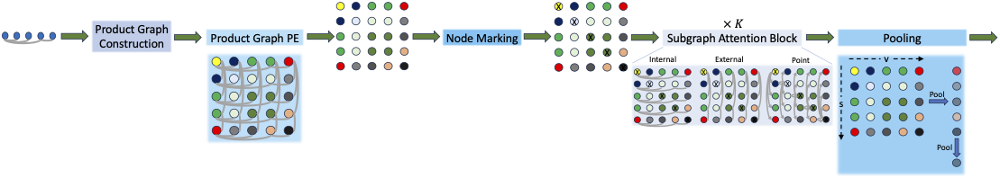

# Subgraphormer

This repository contains the official code of the paper
**[Subgraphormer: Unifying Subgraph GNNs and Graph Transformers via Graph Products](https://arxiv.org/pdf/2402.08450) (ICML 2024)**

<p align="center">
  
</p>

## Table of Contents

- [Installation](#installation)
- [Repreducability](#repreducability)
- [Credits](#credits)

## Installation

First create a conda environment
```
conda env create -f Subgraphormer_environment.yml
```
and activate it
```
conda activate Subgraphormer
```

## Repreducability
### 1. **Run Subgraphormer**

To run subgraphormer on a specific dataset, set the right parameters in the configuration file and simply run:

```bash
python main.py 
```
### 2. **Run a Hyperparameter sweep**
To run a hyperparameter sweep, follow the following steps:

1. ***Create the sweep using a yaml file from the folder `yamls:`***

    ```bash
    wandb sweep -p <your project name> <path to the yaml file>
    ```
    For example:

    ```bash
    wandb sweep -p zinc12k_project ./yamls/zinc12k_deterministic.yaml
    ```
    will run a sweep on the zinc12k dataset with a deterministic model (full bag), in the project `zinc12k_project`.
    ```bash
    wandb sweep -p test_project ./yamls/zinc12k_stochstic.yaml
    ```
    will run a sweep over zinc12k using stochastic sampling.

    This will produce a sweep id

2. ***Run the sweep:***

    ```bash
    wandb agent <sweep id>
    ```

## Acknowledgements
Our code is motivated by the code of **[SWL](https://github.com/subgraph23/SWL)**.

## Credits

For academic citations, please use the following:

```
@inproceedings{
bar-shalom2024subgraphormer,
title={Subgraphormer: Unifying Subgraph {GNN}s and Graph Transformers via Graph Products},
author={Guy Bar-Shalom and Beatrice Bevilacqua and Haggai Maron},
booktitle={Forty-first International Conference on Machine Learning},
year={2024},
url={https://openreview.net/forum?id=6djDWVTUEq}
}
```